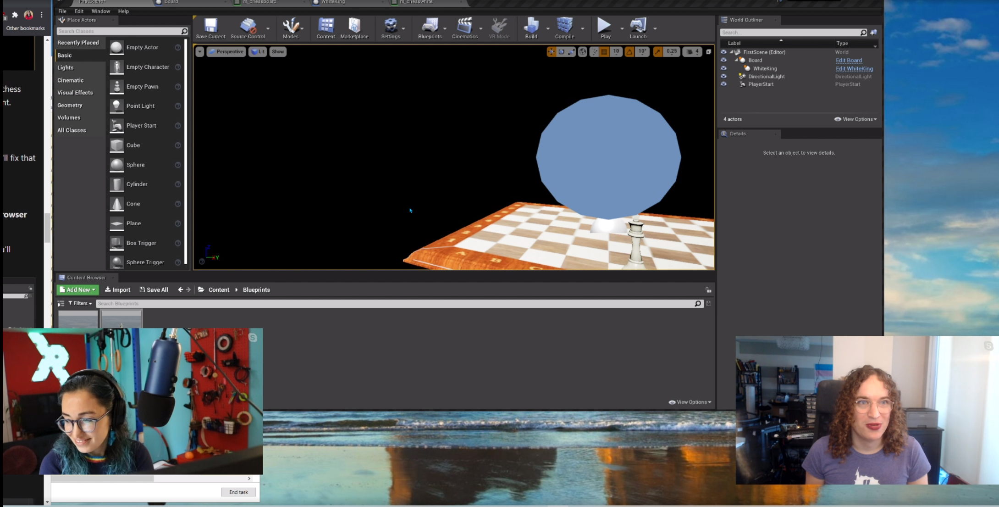

# 30 Days Of Unreal Engine Development

- [Links Cheat Sheet](./LinksCheatSheet.md)
- [Day 01](#day-01--11-august-2020)
- [Day 02](#day-02--18-august-2020)
- [Day 03](#day-03-25-august-2020)

## Overview

30 days of [Unreal Engine Development for HoloLens 2](https://docs.microsoft.com/en-us/windows/mixed-reality/unreal-development-overview?WT.mc_id=github-30daysunreal-ayyonet) is our journey with [Em](https://github.com/lazerwalker) to learn Unreal development for Mixed Reality. We are experienced developers who are learning Unreal Development together. Follow along by downloading or forking the repo branch for the day.

We will create a games in few weeks, let us know what you are interested in learning by opening an issue on this repo or reaching out to us on twitter [@AysSomething](https://twitter.com/AysSomething) or [@LazerWalker](https://twitter.com/lazerwalker).

Catch the stream every Tuesday at [www.twitch.tv/lazerwalker](https://www.twitch.tv/lazerwalker), 2pm PST, 5pm EST. 

## Day 01 : 11 August 2020

Project setup and getting to know the Unreal UI and HoloLens Unreal tutorial.

### Links:

* [Day 1 Tutorial](https://docs.microsoft.com/windows/mixed-reality/unreal-uxt-ch2?WT.mc_id=github-xrteaparty-ayyonet&WT.mc_id=github-30daysunreal-ayyonet)
* Starting project branch: [day-00](https://github.com/Yonet/30DaysOfUnrealEngine/tree/day-00)
* Ending project branch: [day-01](https://github.com/Yonet/30DaysOfUnrealEngine/tree/day-01)
* Video: https://www.twitch.tv/videos/707346232

## Day 02:  18 August 2020

Making your scene interactive.

### Links

* [Day 2 Tutorial](https://docs.microsoft.com/windows/mixed-reality/unreal-uxt-ch4?WT.mc_id=github-30daysunreal-ayyonet)
* Starting project branch: [day-01](https://github.com/Yonet/30DaysOfUnrealEngine/tree/day-01)
<!-- * Ending project branch: [day-02](https://github.com/Yonet/30DaysOfUnrealEngine/tree/day-02) -->

## Day 03: 25 August 2020

<!-- Lighting.

## Day 04 

Camera and postprocessing.

## Day 05

Particles

## Day 06

Physics

## Day 07 -->

